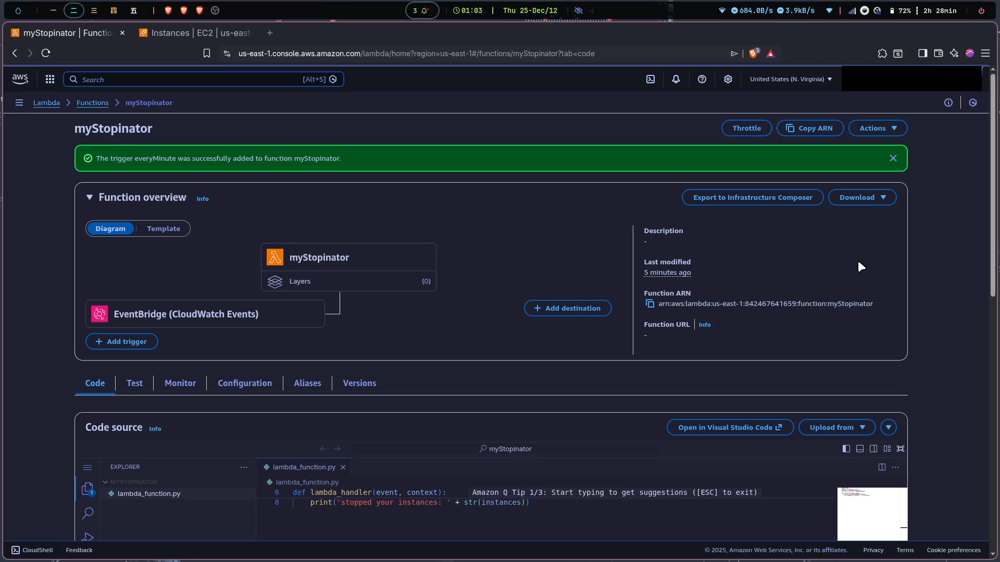
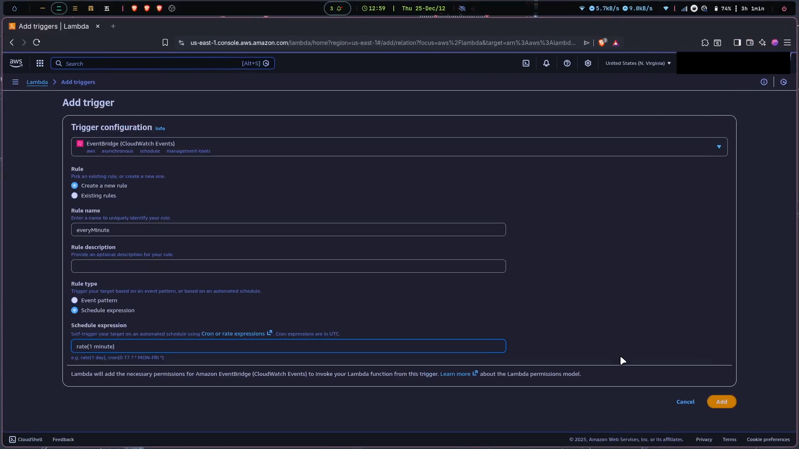
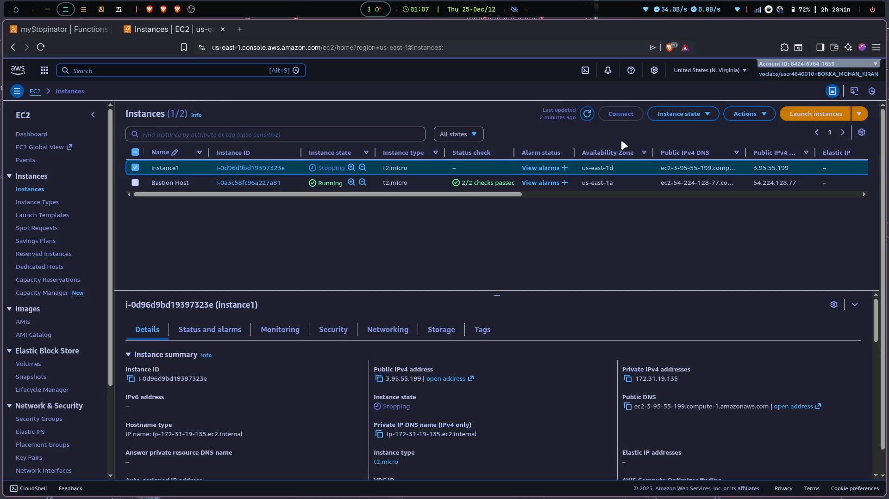

# ☁️ AWS Lambda Stopinator – Automated EC2 Cost Control


---

## 📖 Project Overview

This project implements a **serverless automation mechanism** to control EC2 costs by automatically stopping running instances on a fixed schedule.  
Using **AWS Lambda** and **Amazon EventBridge**, the solution eliminates the need for always-on scheduler servers while enforcing operational cost discipline.

**Business Problem Solved:**  
Idle EC2 instances silently burn money. Humans forget. Automation does not.

---

## ✨ Key Features

- ✅ **Serverless Cost Automation**
- ✅ **Event-Driven Execution**
- ✅ **Least-Privilege IAM Security**
- ✅ **Highly Reliable Managed Services**
- ✅ **Cloud-Native & Cost Efficient**

---

## 🏗️ Architecture Design


### Architecture Flow

1. EventBridge triggers Lambda on a schedule
2. Lambda executes Python logic
3. IAM authorizes EC2 API calls
4. EC2 instance is stopped automatically

---

## 🛠️ Tech Stack

| Layer     | Technology         |
| --------- | ------------------ |
| Compute   | AWS Lambda         |
| Scheduler | Amazon EventBridge |
| Security  | AWS IAM            |
| SDK       | Boto3              |
| Target    | Amazon EC2         |

---

## ⚙️ Implementation Guide

### IAM Role

Permissions:

- ec2:StopInstances
- ec2:DescribeInstances

### Lambda Configuration

- Runtime: Python 3.11
- Function Name: myStopinator

```python
import boto3

region = 'ap-south-1'
instances = ['i-xxxxxxxxxxxxxxxxx']

ec2 = boto3.client('ec2', region_name=region)

def lambda_handler(event, context):
    ec2.stop_instances(InstanceIds=instances)
    print(f"Stopped instances: {instances}")
```

---

## 📸 Proof of Work

  
  


---

## 💰 Cost Analysis

| Service     | Cost      |
| ----------- | --------- |
| Lambda      | Free Tier |
| EventBridge | Free Tier |
| EC2         | Saved     |

---

## ⚠️ Limitations

- Hardcoded instance ID
- Single region scope
- No approval window

---

## 🚀 Future Improvements

- Tag-based discovery
- Notifications
- Terraform IaC
- Multi-region support

---

## 📜 License

MIT
